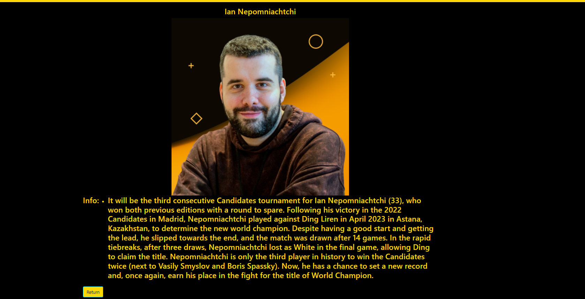

# Candidates Mockup-ASP.NET-Core
Created an ASP.NET Core project to display FIDE Candidates profiles.Integrated SQL Database for storing player information.
## Technologies Used:
- ASP.NET Core, SQL, C#

## How to Install
1. Clone this GitHub Repository to your computer.
2. Open the Project .sln file in Visual Studio and run it.

## Screenshots

